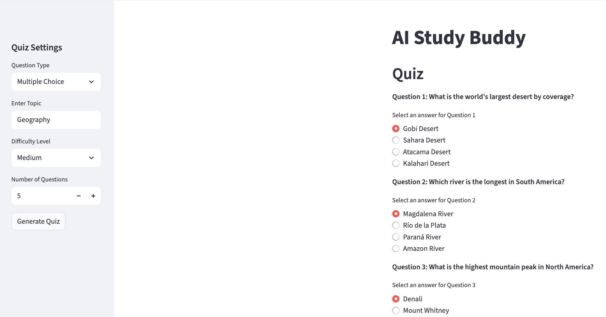
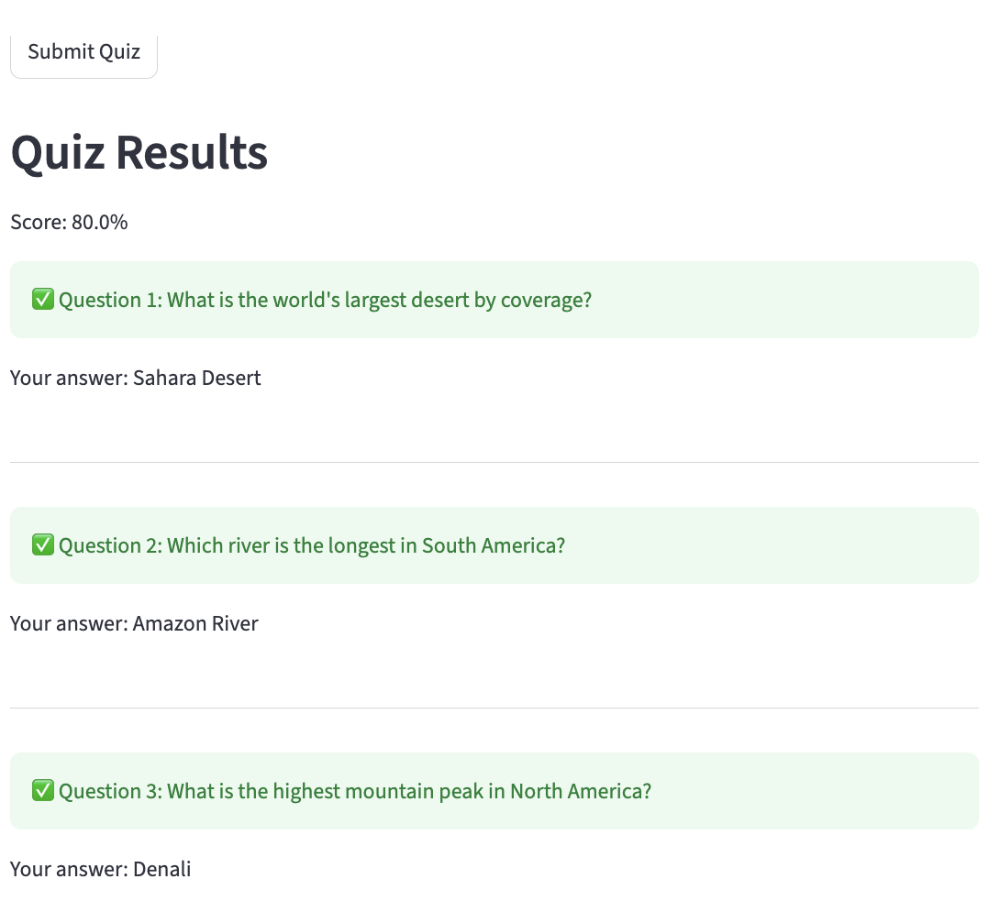

# ai_study_buddy
An LLM-based quiz generation and evalutation app.
Configured for CI/CD (Jenkins), Kubernetes orchestration, and ArgoCD deployment.  
 
A multiple choice or fill-in-the-blanks quiz may be generated, consisting of up to 10 questions on a topic
and a difficulty level of the user's choosing. 
 
Once submitted, the quiz is evaluated, with correct responses displayed. Results may be downloaded in CSV format.

  
  

## Installation:
### Local/Virtual Environment:
Run `pip install -r requirements.txt`

### Docker:
A Dockerfile is included.

To build the image, execute: `docker build -t study-buddy .` 
To run a container/the app: `docker run -d -p 8501:8501 --name study-buddy-container study-buddy`

## Groq API Key:
It will be necessary to create a Groq  API key. It should be stored in a `.env` file in the project
root directory. An `env_dummy.txt` file is provided for reference.  
Groq: https://console.groq.com/keys

## Running the App:
From the project root directory, execute: `streamlit run application.py`